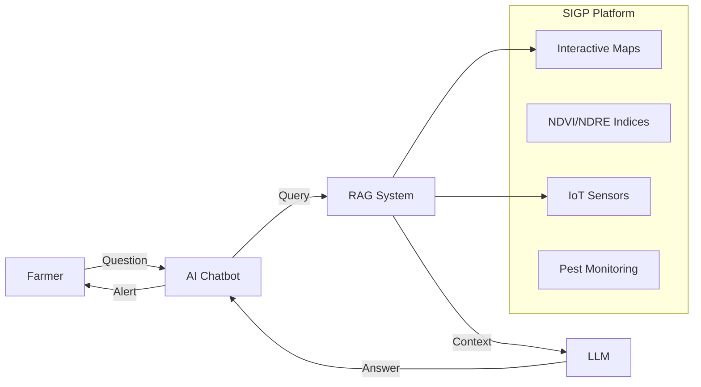

<!-- ANIMATED HEADER -->

  

  
  
  

---

## 👋 About Me

I'm **Alexandre Fernandes**, a **Computer Engineering** student in my final semester at **ESTGV, Portugal**, currently completing my thesis internship focused on **AI-powered agricultural systems**.

I specialize in building **full-stack applications** with modern frameworks and integrating **AI/ML solutions** (LLMs, NLP, RAG) into real-world products. I'm actively preparing for relocation to **Germany 🇩🇪** and seeking opportunities in **AI, Automation, and Software Engineering**.

---

## 🔬 Current Internship — AI Agricultural Chatbot

> **Company:** Geodouro - Consultoria e Topografia, Lda  
> **Duration:** Final Semester 2025/2026

### 🌾 Project: Intelligent Agricultural Chatbot for SIGP

Developing an **AI-powered chatbot** integrated with **SIGP** (Sistema Integrado de Gestão de Parcelas) — a modular agricultural management platform.

#### Key Features

- 🤖 **Generative AI & NLP** for natural, context-aware responses
- 📊 **Data-driven recommendations** using farm-specific data
- 🚨 **Proactive alerts** for pests, diseases, and climate conditions
- 🌐 **Multimodal support** (text + voice) on Web & Mobile
- 🎯 **Target:** Reduce support response time by **70%**

#### Tech Stack

`FastAPI` · `LangChain` · `RAG` · `ChromaDB` · `OpenAI` · `HuggingFace` · `PostgreSQL` · `React` · `Flutter`

---

## 🛠️ Tech Stack

### Languages & Frameworks

### AI & Data

`LangChain` · `LangGraph` · `OpenAI` · `HuggingFace` · `ChromaDB` · `RAG`

### Databases & Infrastructure

### Tools

---

## 🏆 Featured Projects

<table>
<tr>
<td width="50%">

### 🎓 SoftSkills Training Platform

**Web + Mobile + BackOffice**

Full-stack training platform for remote teams with dashboards, course progression, quizzes, and file management.

> _"I would buy it right now."_ — Softinsa Evaluator

**Tech:** React · Node.js · PostgreSQL · Flutter

</td>
<td width="50%">

### 🚗 AI Parking System

**Computer Vision + Backend**

Intelligent parking management with license plate recognition, slot detection, payments, and event logging.

**Tech:** YOLO · FastALPR · FastAPI · PostgreSQL

</td>
</tr>
</table>

📂 <strong>More Projects</strong> (click to expand)

### 📚 LibraryManagementCpp

C++ library system with OOP, user management, borrowing system, and persistence.  

### 👕 ClothFactoryWebsite

Responsive website for a clothing manufacturer with product showcase and contact form.  

---

## 📊 GitHub Stats

  
  

  

---

## 🎯 What's Next

- 🇩🇪 Relocating to **Germany** after graduation
- 🧠 Deepening expertise in **LLMs, RAG, and Agentic AI**
- 🎓 Completing **Bachelor's in Computer Engineering**

---

## 📬 Let's Connect

  
  

